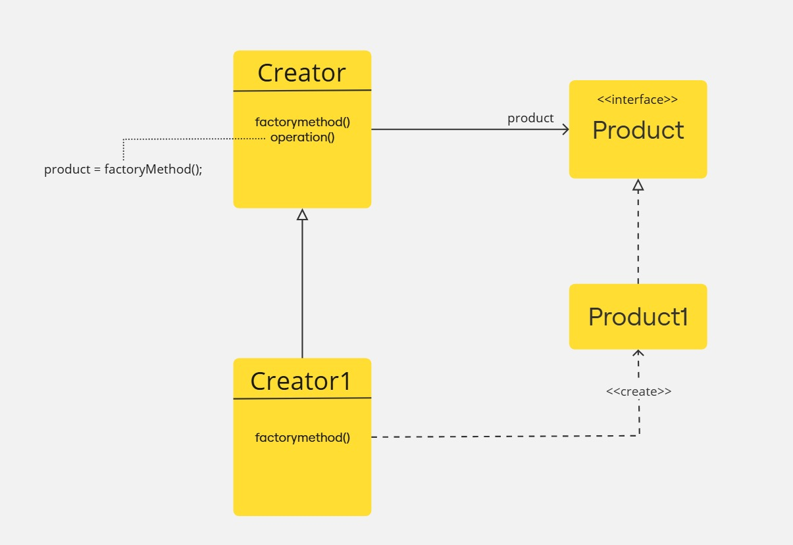

# Padrão de Projeto Factory Method

O padrão Factory Method é um padrão criacional que fornece uma interface para criar objetos em uma classe-mãe, permitindo que as subclasses alterem o tipo de objetos que serão criados. Ele delega a responsabilidade de instanciar objetos para subclasses, promovendo flexibilidade e desacoplamento.

## Intenção Oficial

Definir uma interface para criar um objeto, mas permitir que as subclasses decidam qual classe instanciar. O Factory Method permite adiar a criação de objetos para subclasses.

## Qual Problema ele Soluciona
1. Acoplamento ao tipo concreto: Quando o cliente está acoplado diretamente a classes concretas, mudanças na implementação dessas classes podem quebrar o código cliente.
2. Flexibilidade na criação: Necessidade de permitir que o sistema seja facilmente extensível para novos tipos de produtos sem modificar o código existente.
3. Centralização da lógica de criação: Evita duplicação de lógica de criação em diferentes partes do sistema.

## Quando Usar
1. Quando a criação de objetos precisa ser delegada para subclasses.
2. Quando o código cliente não deve conhecer os detalhes de implementação dos produtos que está utilizando.
3. Quando novos tipos de produtos precisam ser facilmente integrados ao sistema.
4. Quando você deseja desacoplar o cliente das classes concretas que ele usa.

## Prós e Contras
### Prós
- Desacoplamento: Reduz o acoplamento entre o cliente e os produtos concretos.
- Extensibilidade: Facilita a adição de novos produtos sem alterar o código existente.
- Centralização da lógica de criação: Padroniza o processo de criação de objetos.

### Contras
- Complexidade adicional: Adiciona camadas extras ao código devido à criação de classes e hierarquias.
- Subclasses adicionais: Pode aumentar o número de subclasses no projeto, tornando-o mais difícil de gerenciar.

### UML

Na pasta `uml`, pode ser encontrado um arquivo jpg:

- **`generic.jpg`**: apresenta uma demonstração genérica do funcionamento do padrão.

